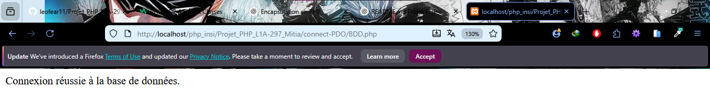

# Projet_PHP_L1A-297_Mitia

## 📜 Description
Ce projet a été réalisé dans le cadre d'un examen pratique. 
Il comprend les exercices 1 à 6 et met en œuvre la programmation orientée objet (POO) en PHP ainsi que l'utilisation d'une base de données MySQL.

## ⚙️ Fonctionnalités
- 🎨 Afficher une interface utilisateur avec Bootstrap 5
- 🏗️ Intégrer les classes PHP (Personne, Etudiant, Animal, etc.) pour démontrer la POO
- 🗄️ Connecter et interagir avec la base de données MySQL

## 🛠️ Technologies utilisées

## 📋 Les tâches à faire
- Créer une classe Compte dans un dossier spécifique pour appliquer le principe d'encapsulation en POO.
- Créer une classe Personne dans un dossier pour illustrer l'héritage en programmation orientée objet (POO).
- Créer une classe **Etudiant** qui hérite de **Personne** afin de démontrer le polymorphisme en POO.
- Créer une classe abstraite **Animal** pour une méthode abstraite **crier()** et l'intégrer dans la classe **Chien** et **Chat**
- Créer une classe abstraite **Animal** comprenant une méthode abstraite **crier()**, et créer les classes **Chien** et **Chat** qui héritent d'**Animal** pour démontrer l’abstraction.
- Créer un fichier **BDD.php** permettant la connexion à la base de données MySQL et affichant un message de succès "Connexion réussie".
- Créer un fichier **index.php** pour illustrer le POO et la connexion aux BDD en utlisant bootstrap-5.
- Créer un fichier **index.php** qui montre l’utilisation de la POO et la connexion à la base de données, avec une interface stylée grâce à **Bootstrap 5**.
- - Créer un fichier **index.php** qui montre l’utilisation de la POO et la connexion à la base de données, avec une interface stylée grâce à **Bootstrap 5**.
## 📂 Structure du projet
```
Projet_PHP_L1A-297_Mitia/
├── classes/
│   ├── Compte.php
│   ├── Personne.php
│   ├── Etudiant.php
│   ├── Animal.php
│   ├── Chien.php
│   └── Chat.php
├── config/
│   └── BDD.php
├── images/
│   └── image.png
├── index.php
└── README.md
```
## 🗄️ Base de données
Nom de la base : **ecole**

La base de données est utilisée pour stocker les informations des élèves, enseignants et classes.


## Utilisation
- Placer les fichiers sur un serveur local (ex. XAMPP, WAMP, ou MAMP) afin de tester la page **index.php** et mieux comprendre la programmation orientée objet (POO) et l'utilisation de PDO pour la connexion à la base de données.

## 👨‍💻 Auteur
Mitia L1A-297